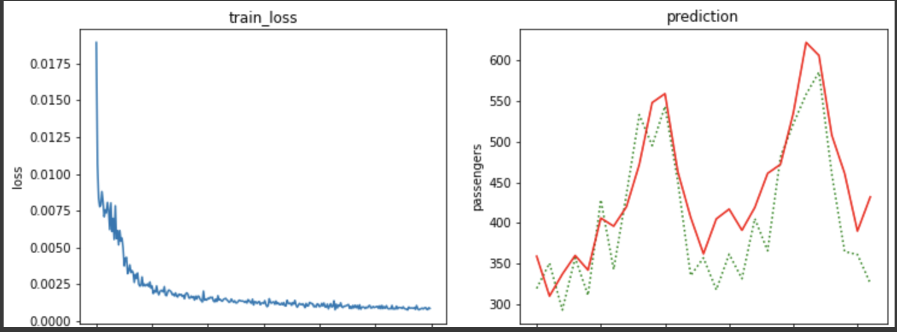

# 109590011 陳彥宇\ 多媒體技術與應用 Project3 個人報告

## 個人心得

這次的作業是要用上次作業訓練的權重檔訓練出一個物件追蹤的模型。這次學到的東西主要就是 YOLOv4 的物件追蹤應用，基本上沒什麼難度，只要照著簡報和官方文件的操作就可以了，唯一的問題就是 gpu 版本，但 google 一下很快就解決了，雖然後來發現助教有在 FB 社團公告解決方法。這次的訓練就沒上次那麼久，大概幾分鐘就訓練完了。

Lecture 12 則是用 LSTM 這個模型做飛機乘客流量的預測，基本上也沒遇到什麼問題，而且也是沒幾分鐘就訓練完成了。所以後續我又試了幾組參數，但看起來效果的差不多，正確率沒有明顯的提升。不過我對 LSTM 在機器翻譯上的應用蠻有興趣的，或許之後有空會用 LSTM 訓練一個簡單的機器翻譯模型來玩玩。

  

## 小組分工表

- 109590011 陳彥宇：報告撰寫 50%
- 109590026 黃亮維：程式與報告撰寫、上傳影片 50%